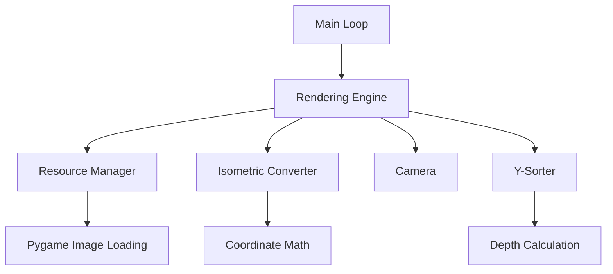

# Design Document: Isometric Rendering Engine

## Overview

The isometric rendering engine is a foundational 2.5D graphics system built on Pygame that transforms a logical 2D grid into an isometric visual representation. The engine implements the painter's algorithm for depth sorting, manages sprite assets through a caching resource manager, and provides camera offset capabilities for future viewport panning.

### Design Goals

1. **Modularity**: Separate concerns into distinct classes (ResourceManager, IsometricConverter, Camera, RenderingEngine)
2. **Performance**: Cache loaded assets and minimize redundant calculations
3. **Correctness**: Ensure proper depth sorting and coordinate transformation
4. **Extensibility**: Design for future features like map panning, entity movement, and additional rendering layers

### Key Technical Decisions

- **Pygame as rendering backend**: Leverages mature 2D graphics library with excellent sprite and surface handling
- **Standard isometric dimensions**: 128x64 pixel tiles provide good visual clarity and are industry-standard
- **Painter's algorithm**: Simple, deterministic depth sorting suitable for tile-based isometric games
- **Object-oriented architecture**: Encapsulates responsibilities and enables testing of individual components

## Architecture

### System Components



### Component Responsibilities

**Main Loop**
- Initializes Pygame and all engine components
- Manages the game loop at fixed FPS (60 by default)
- Handles input events (QUIT)
- Orchestrates render cycle: clear screen → render → flip display

**Rendering Engine**
- Owns the display surface
- Maintains collection of renderable entities
- Delegates coordinate transformation to IsometricConverter
- Delegates depth sorting to Y-Sorter
- Draws sprites to screen in correct order

**Resource Manager**
- Loads PNG images from disk
- Applies `convert_alpha()` for transparency support
- Caches loaded images by file path
- Raises descriptive errors for missing assets

**Isometric Converter**
- Transforms (row, col) grid coordinates to (x, y) screen coordinates
- Applies isometric projection formula
- Integrates camera offsets into final coordinates

**Camera**
- Maintains camera_x and camera_y offset values
- Provides methods to update offsets
- Initialized at (0, 0)

**Y-Sorter**
- Calculates depth value for each entity: depth = row + col
- Sorts entities by depth in ascending order
- Ensures back-to-front rendering

### Data Flow

1. **Initialization**: Main loop creates all components and loads demo assets
2. **Entity Setup**: Entities are created with grid coordinates and sprite paths
3. **Render Cycle**:
   - Main loop clears screen
   - Rendering engine requests sorted entity list from Y-Sorter
   - For each entity (back to front):
     - IsometricConverter calculates screen position with camera offset
     - Resource Manager provides cached sprite
     - Sprite is blitted to display surface
   - Main loop flips display

## Components and Interfaces

### ResourceManager Class

```python
class ResourceManager:
    """Manages loading and caching of image assets."""
    
    def __init__(self):
        self._cache: Dict[str, pygame.Surface] = {}
    
    def load_image(self, path: str) -> pygame.Surface:
        """
        Load a PNG image with transparency support.
        
        Args:
            path: File path to the PNG image
            
        Returns:
            Pygame Surface with alpha channel
            
        Raises:
            FileNotFoundError: If image file does not exist
            pygame.error: If image cannot be loaded
        """
        pass
```

**Key Methods**:
- `load_image(path: str) -> pygame.Surface`: Loads and caches image, returns Surface

**Implementation Details**:
- Uses dictionary for O(1) cache lookups
- Calls `pygame.image.load()` followed by `convert_alpha()`
- Checks cache before loading from disk
- Wraps pygame errors with descriptive messages including file path

### IsometricConverter Class

```python
class IsometricConverter:
    """Converts 2D grid coordinates to isometric screen coordinates."""
    
    TILE_WIDTH = 128
    TILE_HEIGHT = 64
    
    @staticmethod
    def grid_to_screen(row: int, col: int, camera_x: int = 0, camera_y: int = 0) -> Tuple[int, int]:
        """
        Transform grid coordinates to screen coordinates with camera offset.
        
        Isometric projection formula:
        - x = (col - row) * (TILE_WIDTH / 2)
        - y = (col + row) * (TILE_HEIGHT / 2)
        
        Args:
            row: Grid row position
            col: Grid column position
            camera_x: Camera horizontal offset
            camera_y: Camera vertical offset
            
        Returns:
            Tuple of (screen_x, screen_y) in pixels
        """
        pass
```

**Key Methods**:
- `grid_to_screen(row, col, camera_x, camera_y) -> (x, y)`: Transforms coordinates

**Mathematical Explanation**:
The isometric projection creates a diamond-shaped grid where:
- Moving right (col+1) shifts the sprite right and down
- Moving down (row+1) shifts the sprite left and down
- The formula `(col - row)` creates the horizontal diamond axis
- The formula `(col + row)` creates the vertical depth axis
- Multiplying by half tile dimensions scales to pixel space

### Camera Class

```python
class Camera:
    """Manages viewport offset for map panning."""
    
    def __init__(self):
        self.camera_x: int = 0
        self.camera_y: int = 0
    
    def set_offset(self, x: int, y: int) -> None:
        """Set camera offset values."""
        pass
    
    def get_offset(self) -> Tuple[int, int]:
        """Get current camera offset."""
        pass
```

**Key Methods**:
- `set_offset(x, y)`: Updates camera position
- `get_offset() -> (x, y)`: Returns current offset

**Design Notes**:
- Simple data holder for Phase 1
- Future enhancements: smooth scrolling, bounds checking, follow target

### Entity Class

```python
class Entity:
    """Represents a renderable game object."""
    
    def __init__(self, row: int, col: int, sprite_path: str):
        self.row: int = row
        self.col: int = col
        self.sprite_path: str = sprite_path
        self.depth: int = row + col
    
    def update_position(self, row: int, col: int) -> None:
        """Update entity position and recalculate depth."""
        pass
```

**Key Attributes**:
- `row, col`: Grid position
- `sprite_path`: Path to PNG asset
- `depth`: Cached depth value for sorting

### Y-Sorter Class

```python
class YSorter:
    """Handles depth sorting for painter's algorithm."""
    
    @staticmethod
    def sort_by_depth(entities: List[Entity]) -> List[Entity]:
        """
        Sort entities by depth value (row + col) in ascending order.
        
        Objects with lower depth values are further back and drawn first.
        Uses stable sort to maintain consistent ordering for equal depths.
        
        Args:
            entities: List of Entity objects to sort
            
        Returns:
            Sorted list (back to front)
        """
        pass
```

**Key Methods**:
- `sort_by_depth(entities) -> sorted_entities`: Returns depth-sorted list

**Sorting Logic**:
- Depth = row + col (objects further from origin have higher depth)
- Ascending sort ensures back-to-front rendering
- Python's `sorted()` provides stable sort for equal depths

### RenderingEngine Class

```python
class RenderingEngine:
    """Core rendering system that draws isometric graphics."""
    
    def __init__(self, screen: pygame.Surface, resource_manager: ResourceManager, 
                 camera: Camera):
        self.screen: pygame.Surface = screen
        self.resource_manager: ResourceManager = resource_manager
        self.camera: Camera = camera
        self.entities: List[Entity] = []
    
    def add_entity(self, entity: Entity) -> None:
        """Add an entity to the render list."""
        pass
    
    def render(self) -> None:
        """Render all entities in depth-sorted order."""
        pass
```

**Key Methods**:
- `add_entity(entity)`: Adds entity to render list
- `render()`: Executes full render pipeline

**Render Pipeline**:
1. Sort entities by depth using Y-Sorter
2. For each entity:
   - Get camera offset from Camera
   - Calculate screen position via IsometricConverter
   - Load sprite from ResourceManager
   - Blit sprite to screen at calculated position

### Main Loop

```python
def main():
    """Initialize and run the game loop."""
    pygame.init()
    screen = pygame.display.set_mode((SCREEN_WIDTH, SCREEN_HEIGHT))
    clock = pygame.time.Clock()
    
    # Initialize components
    resource_manager = ResourceManager()
    camera = Camera()
    rendering_engine = RenderingEngine(screen, resource_manager, camera)
    
    # Setup demo scene
    setup_demo_scene(rendering_engine)
    
    # Main loop
    running = True
    while running:
        for event in pygame.event.get():
            if event.type == pygame.QUIT:
                running = False
        
        screen.fill((0, 0, 0))  # Clear screen
        rendering_engine.render()
        pygame.display.flip()
        clock.tick(FPS)
    
    pygame.quit()
```

## Data Models

### Configuration Constants (settings.py)

```python
# Display settings
SCREEN_WIDTH = 1024
SCREEN_HEIGHT = 768
FPS = 60

# Isometric tile dimensions
TILE_WIDTH = 128
TILE_HEIGHT = 64

# Demo scene settings
DEMO_GRID_SIZE = 5
DEMO_ENTITY_ROW = 2
DEMO_ENTITY_COL = 2

# Asset paths
FLOOR_TILE_PATH = "assets/floor_tile.png"
ENTITY_SPRITE_PATH = "assets/entity.png"
```

### Entity Data Structure

```python
@dataclass
class Entity:
    row: int          # Grid row position
    col: int          # Grid column position
    sprite_path: str  # Path to sprite asset
    depth: int        # Cached depth value (row + col)
```

**Invariants**:
- `depth` must always equal `row + col`
- `row` and `col` must be non-negative integers
- `sprite_path` must point to a valid PNG file

### Coordinate Systems

**Grid Coordinates**: Logical 2D array positions
- Origin (0, 0) at top-left of grid
- Row increases downward
- Col increases rightward

**Screen Coordinates**: Pixel positions on display
- Origin (0, 0) at top-left of screen
- X increases rightward
- Y increases downward

**Isometric Space**: Visual diamond grid
- Origin at top point of diamond
- Moving right in grid space moves right-down in screen space
- Moving down in grid space moves left-down in screen space


## Correctness Properties

*A property is a characteristic or behavior that should hold true across all valid executions of a system—essentially, a formal statement about what the system should do. Properties serve as the bridge between human-readable specifications and machine-verifiable correctness guarantees.*

### Property 1: Image Loading Succeeds for Valid Paths

*For any* valid PNG file path, the ResourceManager SHALL successfully load the image and return a Pygame Surface.

**Validates: Requirements 2.1**

### Property 2: Loaded Images Have Alpha Channel

*For any* image loaded by the ResourceManager, the returned Surface SHALL have an alpha channel (indicating convert_alpha() was applied).

**Validates: Requirements 2.2**

### Property 3: Image Caching Returns Same Object

*For any* image path, loading it multiple times through the ResourceManager SHALL return the same cached Surface object (identity equality, not just value equality).

**Validates: Requirements 2.3**

### Property 4: Invalid Paths Raise Descriptive Errors

*For any* invalid or non-existent file path, the ResourceManager SHALL raise an error that includes the problematic path in the error message.

**Validates: Requirements 2.4**

### Property 5: Coordinate Transformation Formula Correctness

*For any* grid coordinates (row, col) with camera offsets (0, 0), the IsometricConverter SHALL produce screen coordinates where:
- x = (col - row) * 64
- y = (col + row) * 32

**Validates: Requirements 3.1**

### Property 6: Camera Offset Application

*For any* grid coordinates (row, col) and any camera offsets (camera_x, camera_y), the IsometricConverter SHALL add camera_x to the calculated x coordinate and camera_y to the calculated y coordinate.

**Validates: Requirements 3.4**

### Property 7: Depth Calculation Correctness

*For any* Entity with grid position (row, col), the depth value SHALL equal (row + col).

**Validates: Requirements 4.2**

### Property 8: Depth-Based Ordering

*For any* pair of entities where entity_A has depth less than entity_B, when sorted by the Y-Sorter, entity_A SHALL appear before entity_B in the sorted list.

**Validates: Requirements 4.1, 4.3, 4.5**

### Property 9: Stable Sort for Equal Depths

*For any* list of entities containing multiple entities with equal depth values, the Y-Sorter SHALL preserve the relative order of those equal-depth entities (stable sort property).

**Validates: Requirements 4.4**

### Property 10: Camera Offset Round-Trip

*For any* offset values (x, y), setting the Camera offset to (x, y) and then retrieving the offset SHALL return the same values (x, y).

**Validates: Requirements 5.1, 5.4**

## Error Handling

### Resource Loading Errors

**Missing Asset Files**
- **Detection**: ResourceManager catches `pygame.error` or `FileNotFoundError` during image loading
- **Response**: Raise custom `AssetLoadError` with descriptive message including file path
- **Recovery**: None - missing assets are fatal errors during initialization
- **User Feedback**: Error message format: `"Failed to load asset: {path} - {original_error}"`

**Corrupted Image Files**
- **Detection**: Pygame raises error during `load()` or `convert_alpha()`
- **Response**: Raise `AssetLoadError` with file path and corruption indication
- **Recovery**: None - corrupted assets must be fixed
- **User Feedback**: Clear indication that file exists but is invalid

**Invalid File Paths**
- **Detection**: Path does not exist or is not a file
- **Response**: Raise `FileNotFoundError` with full path
- **Recovery**: None - paths must be corrected
- **User Feedback**: Include attempted path in error message

### Coordinate Transformation Errors

**Invalid Grid Coordinates**
- **Detection**: Negative row or col values (if validation is added)
- **Response**: Currently no validation - negative values are mathematically valid
- **Future Enhancement**: Add optional bounds checking if grid size is known

**Integer Overflow**
- **Detection**: Extremely large row/col values causing overflow
- **Response**: Python handles arbitrary precision integers, so overflow is not a concern
- **Mitigation**: None needed for Python implementation

### Rendering Errors

**Empty Entity List**
- **Detection**: No entities to render
- **Response**: Render loop completes successfully with no operations
- **Recovery**: Normal operation - empty scenes are valid

**Pygame Surface Errors**
- **Detection**: Pygame raises error during blit operation
- **Response**: Allow exception to propagate with context
- **Recovery**: None - indicates serious Pygame state issue
- **Logging**: Log entity details and screen coordinates for debugging

### Main Loop Errors

**Pygame Initialization Failure**
- **Detection**: `pygame.init()` returns error count > 0
- **Response**: Check return value and raise initialization error
- **Recovery**: None - Pygame must initialize successfully
- **User Feedback**: Indicate which Pygame modules failed

**Display Mode Failure**
- **Detection**: `pygame.display.set_mode()` raises exception
- **Response**: Catch and re-raise with display dimensions
- **Recovery**: None - display must be created
- **User Feedback**: Include requested dimensions in error

**Clock Tick Errors**
- **Detection**: Extremely rare - clock.tick() is robust
- **Response**: Allow exception to propagate
- **Recovery**: None needed

## Testing Strategy

### Overview

The isometric rendering engine will be tested using a dual approach:
1. **Property-based tests** for core mathematical and algorithmic correctness
2. **Example-based unit tests** for specific scenarios, integration points, and edge cases

This combination ensures both comprehensive input coverage (via property tests) and verification of specific behaviors (via unit tests).

### Property-Based Testing

**Framework**: We will use **Hypothesis** for Python, which is the standard property-based testing library for the ecosystem.

**Configuration**: Each property test will run a minimum of 100 iterations to ensure thorough coverage of the input space.

**Test Organization**: Property tests will be organized in `tests/test_properties.py` with each test corresponding to a design document property.

#### Property Test Specifications

**Property 1: Image Loading Succeeds for Valid Paths**
- **Generator**: Create temporary PNG files with valid image data
- **Test**: Load each generated file path, verify Surface is returned
- **Tag**: `# Feature: isometric-rendering-engine, Property 1: For any valid PNG file path, the ResourceManager SHALL successfully load the image and return a Pygame Surface`

**Property 2: Loaded Images Have Alpha Channel**
- **Generator**: Create temporary PNG files with various formats
- **Test**: Load each file, verify `surface.get_flags() & pygame.SRCALPHA` is true
- **Tag**: `# Feature: isometric-rendering-engine, Property 2: For any image loaded by the ResourceManager, the returned Surface SHALL have an alpha channel`

**Property 3: Image Caching Returns Same Object**
- **Generator**: Generate random file paths (with actual temp files)
- **Test**: Load same path twice, verify `surface1 is surface2` (identity check)
- **Tag**: `# Feature: isometric-rendering-engine, Property 3: For any image path, loading it multiple times SHALL return the same cached Surface object`

**Property 4: Invalid Paths Raise Descriptive Errors**
- **Generator**: Generate random non-existent file paths
- **Test**: Attempt to load, verify exception is raised and path appears in error message
- **Tag**: `# Feature: isometric-rendering-engine, Property 4: For any invalid file path, the ResourceManager SHALL raise an error that includes the path`

**Property 5: Coordinate Transformation Formula Correctness**
- **Generator**: Generate random integer (row, col) pairs in range [-1000, 1000]
- **Test**: Verify output matches formula: x = (col - row) * 64, y = (col + row) * 32
- **Tag**: `# Feature: isometric-rendering-engine, Property 5: For any grid coordinates, the IsometricConverter SHALL produce correct screen coordinates`

**Property 6: Camera Offset Application**
- **Generator**: Generate random (row, col) and (camera_x, camera_y) values
- **Test**: Verify screen coordinates include camera offsets correctly
- **Tag**: `# Feature: isometric-rendering-engine, Property 6: For any grid coordinates and camera offsets, offsets SHALL be added to screen coordinates`

**Property 7: Depth Calculation Correctness**
- **Generator**: Generate random Entity objects with various (row, col) values
- **Test**: Verify entity.depth == entity.row + entity.col
- **Tag**: `# Feature: isometric-rendering-engine, Property 7: For any Entity, depth SHALL equal row + col`

**Property 8: Depth-Based Ordering**
- **Generator**: Generate lists of entities with random positions
- **Test**: Sort using Y-Sorter, verify all pairs satisfy depth ordering
- **Tag**: `# Feature: isometric-rendering-engine, Property 8: For any pair of entities with different depths, lower depth SHALL appear first after sorting`

**Property 9: Stable Sort for Equal Depths**
- **Generator**: Generate lists with intentionally duplicated depth values
- **Test**: Sort and verify relative order of equal-depth entities is preserved
- **Tag**: `# Feature: isometric-rendering-engine, Property 9: For any list with equal-depth entities, Y-Sorter SHALL preserve relative order`

**Property 10: Camera Offset Round-Trip**
- **Generator**: Generate random (x, y) offset values
- **Test**: Set camera offset, get camera offset, verify values match
- **Tag**: `# Feature: isometric-rendering-engine, Property 10: For any offset values, setting then getting SHALL return the same values`

### Example-Based Unit Tests

Unit tests will focus on specific scenarios, integration points, and edge cases that complement the property tests.

**Test Organization**: Unit tests will be organized in `tests/test_units.py` grouped by component.

#### ResourceManager Unit Tests
- Test loading a specific known PNG file
- Test error message format for missing file
- Test cache hit behavior with specific file

#### IsometricConverter Unit Tests
- Test origin point (0, 0) maps to (0, 0)
- Test specific known coordinates: (1, 0), (0, 1), (2, 2)
- Test that TILE_WIDTH = 128 and TILE_HEIGHT = 64

#### Camera Unit Tests
- Test initial state is (0, 0)
- Test set_offset updates both x and y
- Test get_offset returns tuple

#### Y-Sorter Unit Tests
- Test empty list returns empty list
- Test single entity returns single entity
- Test specific 3-entity example with known depths

#### RenderingEngine Unit Tests
- Test add_entity increases entity count
- Test render calls resource_manager.load_image for each entity
- Test render calls screen.blit for each entity

#### Main Loop Unit Tests
- Test initialization creates all components
- Test QUIT event terminates loop
- Test screen.fill is called each frame
- Test rendering_engine.render is called each frame

### Integration Tests

**Test Organization**: Integration tests in `tests/test_integration.py`

#### Full Rendering Pipeline Test
- Create complete system with all components
- Add multiple entities at various positions
- Execute render cycle
- Verify entities are drawn in correct order (via mock tracking)

#### Demo Scene Test
- Run setup_demo_scene()
- Verify 25 floor tiles are added (5x5 grid)
- Verify 1 entity at position (2, 2)
- Verify camera is centered

#### Asset Loading Integration Test
- Test with actual PNG files in assets directory
- Verify all demo assets load successfully
- Test fallback to placeholder if assets missing

### Test Coverage Goals

- **Line Coverage**: Minimum 90% for all core components
- **Branch Coverage**: Minimum 85% for conditional logic
- **Property Coverage**: 100% of design document properties implemented as tests

### Testing Tools

- **Test Framework**: pytest
- **Property Testing**: Hypothesis
- **Mocking**: unittest.mock
- **Coverage**: pytest-cov
- **CI Integration**: Tests run on every commit via GitHub Actions

### Test Execution

```bash
# Run all tests
pytest tests/

# Run only property tests
pytest tests/test_properties.py

# Run with coverage
pytest --cov=src --cov-report=html tests/

# Run specific property test
pytest tests/test_properties.py::test_coordinate_transformation_formula
```

### Future Testing Enhancements

- **Performance tests**: Measure rendering performance with large entity counts
- **Visual regression tests**: Capture and compare rendered output images
- **Stress tests**: Test with extreme coordinate values and entity counts
- **Mutation testing**: Use mutmut to verify test suite quality
